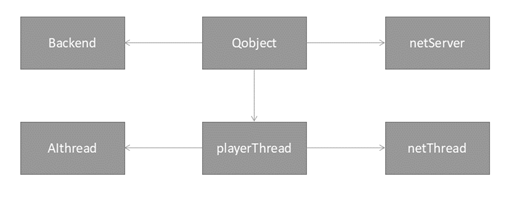
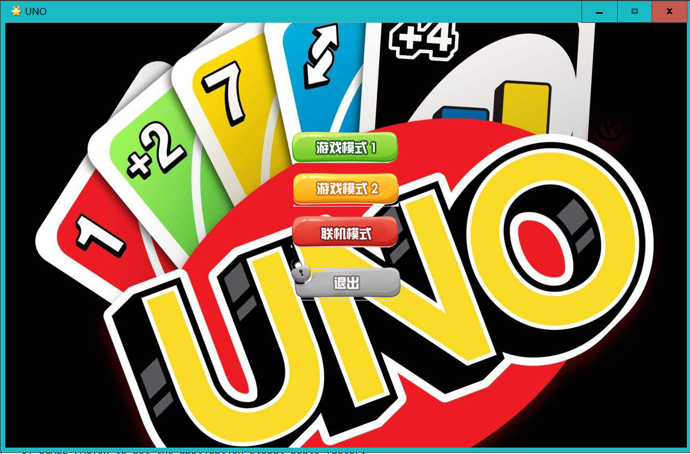
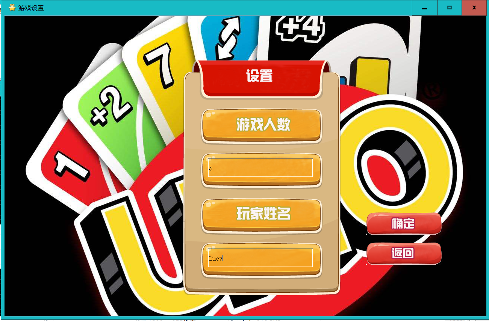
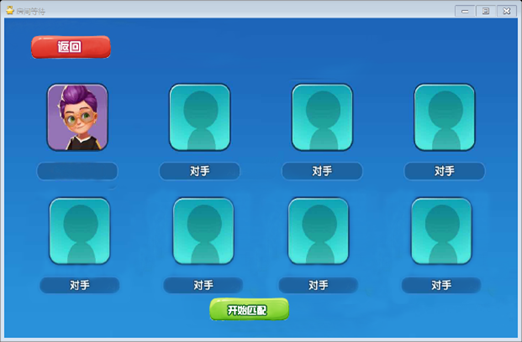
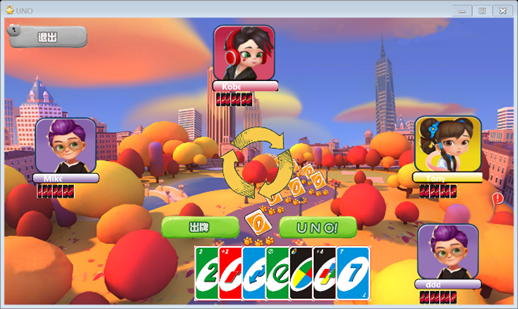
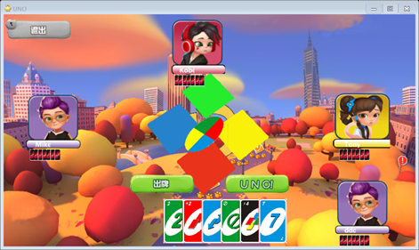

# 文件结构：

- backend：单独的后端代码，包含后端测试；
- src: 源文件。包含完整的项目工程；
- document: 文档及图片相关，包含设计文档、接口、日志、代码风格规范等；

# 目录

<!-- TOC -->

- [](#)
- [1. 需求分析](#1-需求分析)
  - [1.1. UNO卡牌游戏的基本功能](#11-uno卡牌游戏的基本功能)
  - [1.2. UNO卡牌游戏的规则](#12-uno卡牌游戏的规则)
- [2. 总体设计](#2-总体设计)
- [3. 系统设计难点](#3-系统设计难点)
  - [3.1. 前端](#31-前端)
  - [3.2. 后端](#32-后端)
  - [3.3. 前后端接口](#33-前后端接口)
    - [3.3.1. 交互定义](#331-交互定义)
- [4. 模块设计](#4-模块设计)
  - [4.1. 前端模块设计](#41-前端模块设计)
  - [4.2. 游戏逻辑](#42-游戏逻辑)
  - [4.3. AI模块](#43-ai模块)
  - [4.4. 网络逻辑：](#44-网络逻辑)
    - [4.4.1. 游戏阶段](#441-游戏阶段)
      - [房间创建](#房间创建)
      - [加入房间](#加入房间)
      - [双向心跳检测](#双向心跳检测)
      - [游戏开始](#游戏开始)
    - [4.4.2. 交互规范](#442-交互规范)
- [5. 程序运行界面](#5-程序运行界面)
  - [5.1. 开始界面](#51-开始界面)
  - [5.2. 设置界面](#52-设置界面)
  - [5.3. 等待界面](#53-等待界面)
  - [5.4. 游戏主界面](#54-游戏主界面)
  - [5.5. 选择卡牌](#55-选择卡牌)
- [6. 总结](#6-总结)
- [7. 程序使用说明](#7-程序使用说明)
- [8. 系统开发日志](#8-系统开发日志)

<!-- /TOC -->

# 1. 需求分析

UNO纸牌已经风靡全球数十年，被誉为是世界上最好玩的纸牌游戏，据说由意大利一个理发师发明，简单易学，版本众多，被加入许多新的功能，玩法更加刺激，而在此游戏中最考的是集中和反应，还有相互间的思维较量。

基于此，我们开发了一款可联机对战的UNO纸牌游戏：

## 1.1. UNO卡牌游戏的基本功能

- 友好的图形用户界面
- 支持2种uno游戏模式
- 支持 2 - 8人参与游戏
- 支持单人游戏，其他参与者为AI‘
- 支持不同玩家局域网内联机参与游戏

## 1.2. UNO卡牌游戏的规则

每副uno牌包括：108张牌和一张说明书（108 张纸牌中包括76张数字牌，32张特殊牌）。Uno由红黄蓝绿4种颜色,每种色牌各有0号牌1张、1~9号牌各两张，各种颜色还各有6张普通功能牌（“draw 2(加两张)”、“skip(跳过下家)”、“reverse(逆转方向)”各两张。

首先，每人发8张牌，胜利条件是谁的牌首先出完；可以出与上家颜色相同或数字相同的牌，或者wild牌。然后，可以出draw 2（+2） 或draw 4（+4）来陷害下家，让下家摸牌，下家可以出相应的牌来转移或累加要摸的牌，直到最后被陷害的玩家没有更大的牌时，就要摸相应的数量的牌，这样总有人要摸很多牌。然后，玩家在打完倒数第二张牌时要喊UNO(剩一张），捉住其他玩家忘了喊剩一张而罚他摸两张也是游戏的乐趣之一。

具体规则可参考：

[UNO牌标准版简介及规则说明](document/UNO牌标准版简介及规则说明.pdf)

# 2. 总体设计

本课程设计基于Qt与C++实现一个具有友好的图形用户界面的在线多人UNO牌游戏，参照一般意义上的UNO牌的规则，游戏支持两种UNO游戏模式：一种模式为通用UNO牌玩法，第二种模式可抢出牌，同时。游戏程序支持1 - 8 人使用，可选玩家人数，如果实际玩家不足设定的玩家人数，游戏将采用AI模拟其他玩家。也可仅有一人参与，其他全部使用AI模拟（单机游戏）。同时游戏可以在一台计算机上运行，也可在由多台计算机在局域网内联机运行。玩家可以创建房间，并将自己的计算机作为server端，其他玩家作为client端可加入房间进行联机。游戏程序采用C/S架构，集成server与client，不区分server端程序与client端程序版本。

我们采用了git进行协作开发，仓库地址：

[https://github.com/yunwei37/UNO-game-oop](https://github.com/yunwei37/UNO-game-oop)

参考的编码规范：

[Cpp编码规范.md](document/Cpp编码规范.md)

分工：

- ：组长，负责网络通信、多线程部分和总体架构设计、前后端整合；
- ：负责后端逻辑设计和实现
- ：负责后端逻辑实现
- ：负责前端界面设计和实现

# 3. 系统设计难点

游戏采用前后端分离的模式，将前后端分为两个小组进行开发，最后进行合并：前端负责界面设计与实现；后端负责具体逻辑与网络部分；

## 3.1. 前端

前端主要是界面显示的部分，初界面、设置界面、准备界面、游戏界面及胜利界面五个界面，采用qt的 Widget 类进行派生实现。

## 3.2. 后端

> 
>后端架构框图：
>
>

游戏的后端逻辑由几个主要的类以及它们的联系来完成。这些类可以记录玩家的信息、某一步的操作信息、当前游戏的状态等。它们之间的关系如上图所示。
- `Qobject` 是 Qt 类的基类，因为游戏的图形界面通过 Qt 实现，同时需要采用信号 / 槽机制通信，所以其他类都是 Qobject 的派生类。
- `Backend` 是后端类，可以由前端从中获取状态信息和通过它进行操作。
- `NetServer、netThread` 类用于传递联网玩家的数据报，以便实现信息的通讯。
- `PlayerThread` 的成员是一个玩家的身份信息和操作信息。而 AIthread 和 `netThread` 是 `PlayerThread` 的子类，分别是AI玩家类和联网玩家类。
- 还有一个很重要的类是 `card` ，每个类是一张游戏牌，成员包括卡牌本身的信息以及提供私有成员信息的接口。

## 3.3. 前后端接口

前后端接口是主要的由于全局中只有一个玩家，即操作者；其他玩家的牌不需要在前端显示，可以把uno抽象成一个状态机来看：前端输入行为，获取当前状态；后端通过行为计算当前状态。

### 3.3.1. 交互定义

前后端的交互发生在：

- 玩家做出选择对应动作，即按下按钮之后；
- 其他玩家完成交互动作时’

前端用户作出操作后将数据通过函数调用返回给后端，在后端完成计算之后，前端等待一定时间（可加载动画）之后刷新界面；

backend.cpp:


    后端类：可以由前端进行获取状态信息和进行操作；
    每个其他玩家都是一个类，在backend中声明；前端和后端唯一的接口就是这个类。
    在前端每次完成相关显示动作之后调用函数

    getCurrentStatue();

    获取当前状态；注意，如果没有任何操作就能改变状态的话，该函数也会改变状态，如连续发牌，或跳过当前玩家；
    需要每次调用过getCurrentStatue()函数后依次查看其他信息是否有更改

    状态 flag：
        -2    Error
        -1      创建类时初始化，游戏准备状态，等待网络连接;
        0       进入游戏，开始发牌；
        1       当前玩家可进行操作，选择摸牌或出牌；
        2       当前玩家已选择摸牌，更新手牌；
        3       当前玩家在摸牌后可以选择出牌；（可能存在）
        4       当前玩家已选择出牌，更新手牌和牌堆；（如果出的是颜色牌，需要在前端选择颜色，这一部分交给前端判断）
        （2 - 4代表回合结束）
        对于下一个玩家，在其回合开始前可显示：
        5       上一个玩家忘了叫UNO，可以质疑；
        6       跳过回合
        7       需要摸牌n张并跳过回合
        8       游戏胜利
        9       游戏失败


        部分规则：
            以自己为第一个出牌玩家；
            目前不支持连出多张+N牌；
            可以选择摸牌，不需要没有牌的时候再进行，选择摸完牌之后如果手牌上的牌能够出牌，可以立即选择出牌；

前端向后端发送状态则采用信号与槽的方式进行：

```cpp
public slots:
    // 前端调用
    void startGame();
    void sayUNO();
    void playCard(int cardID,Card::COLOR color);
    void drawCard();

```

# 4. 模块设计

## 4.1. 前端模块设计

前端设计的关注点在于不同场景的切换，随着游戏的深入，一共有初界面、设置界面、准备界面、游戏界面及胜利界面五个界面，将其设计为了五个类，分别为`mainwindow`、`mysetwindow`、`readywindow`、`mygamewindow` 及`victory`。其中 `mainwindow` 界面中选择游戏模式后进入 `mysetwindow` ，在其中设置名字后进入 `readywindow` ，开始匹配；在匹配结束后进入到 `mygamewindow` ，倘若最终获胜则顺利进入到 `victory` 界面中。
	
在五个界面中的设计过程中，运用最多的组件为按钮 `mypushbutton` 类，调用已有类之外，加入图片显示及附加效果，使按钮符合本游戏的需要，同时在Qt设计中通过定时器可以设计出按钮弹起落下的动画效果，进而通过按钮的选择进行切换界面和参数确定。绘图方法采用 `Qpainter` ，一般情况下确定位置定点画图，在`mygamewindow` 中还通过确定中心而实现了组件的旋转。
	
在前端显示中，游戏参与者以及卡牌都有自己的类 `PlayerWidget` 以及 `CardWidget`, `PlayerWidget` 类中实现游戏玩家头像名字的显示，通过动态数组实现牌组。`CardWidget` 则为单个卡牌界面的定义类，其中包含单个卡牌的详细信息，以及其在游戏过程中可能会出现的移动效果。

## 4.2. 游戏逻辑

卡牌的定义在cards.h文件中:

每副游戏牌共有108张卡牌，游戏牌分四种颜色：红色、绿色、蓝色及黄色，每种颜色各有25张牌（合共100张），其中19张为数字牌（0牌有一张，1-9有两张），其余6张（24张）为功能牌："skip"（跳牌）、"draw two"（罚牌2张）及"reverse"（反转出牌方向），每种各2张。另有黑色特别牌8张："wild"（转色）及"wild draw four"（转色及罚牌4张），每种各4张。

出牌时客户端保存着自己的手牌handcard数组，handcard数组的元素Card来源必须是调用Card::getCardById()得到的卡牌，或是从Card::getAllCards()数组中取得的卡牌。

## 4.3. AI模块

本设计使用了简单AI设计，Aithread类继承playerThread类，Aithread为计算机提供简单的与玩家对战的策略。实际上，AI会利用 getPlayerValidCards（） 来计算可以用来出牌的手牌的ID，当然在大部分情况下，可以用来出牌的手牌不止一张，这时，选择随机的选择出牌ID。如果抽中的牌是功能牌，比如万能牌（Wild），则需要AI随机的为功能牌分配颜色。最后，如果没有能够打出去的手牌，则Ai选择抽取一张牌。

## 4.4. 网络逻辑：

通过UDP广播发现局域网中可能存在的其他玩家，由对方建立TCP连接加入游戏房间；通过远程玩家类实现远程操作。以下是通信设计：

### 4.4.1. 游戏阶段

#### 房间创建

角色：游戏房间创建者（同时作为服务端和客户端）、其他的游戏参与者（客户端）

游戏房间创建时不用设定人数，但系统限制最多8人，是由游戏房间创建者保存目前加入的人数。

其他的游戏参与者需要进入房间，进入房间时向游戏房间的创建者告知自己已经加入，并携带自己的`player_name`，由服务端保存

#### 加入房间

客户端加入房间时：`JOIN_ROOM <player_name>`

若房间未满，服务端向客户端回应确认加入的数据包，分配`player_id`，并在回应数据包中携带当前的玩家数量`player_count`（包含当前玩家）、当前玩家的列表（包含当前玩家）。

客户端保存此`player_id`作为与服务器通信的凭据标识，保存`player_count`、以及玩家列表显示在UI界面当中

```
JOIN_ACK <player_count> <player_id>\n
<player_id> <playername>\n
<player_id> <playername>\n
<player_id> <playername>\n
EOF
```

然后服务端再向所有已经在房间内的其他玩家宣告此玩家加入了游戏，其他玩家需要更新自己存储的玩家列表，并显示在UI当中。

交互规范：`NEWPLAYER <player_id> <playername> `

1. `player_id`表示新来的玩家的id，`playername`就是新来的玩家的名字

#### 双向心跳检测

在服务端与客户端启动之后，就应该启动双向心跳检测，有新的客户端进入房间，则新客户端与服务端直接也要启动双向心跳检测，游戏过程中亦应该保持心跳检测。

交互规范：

* 服务端广播：`SERVERKEEPALIVE`
* 客户端广播：`CLIENTKEEPALIVE <player_id>`

若发生客户端检测到服务端掉线，则直接返回开始界面

服务端检测到某客户端掉线，则向所有其他玩家广播此客户端掉线，参数为掉线的客户端的`id`。

交互规范：`PLAYERLEAVE <player_id>`

若在游戏准备阶段掉线，则服务端、每个客户端需从玩家列表从移除此玩家。

若在游戏中掉线，则直接结束游戏。

#### 游戏开始

游戏房间创建者启动游戏时，向所有玩家进行广播`GAMESTART`，没有参数

游戏房间创建者即服务端，就默认作为第一个出牌

每次出牌时，玩家向服务器提交出牌信息，服务器直接向场上所有玩家转发此玩家的出牌信息。

关于卡牌的定义在`cards.h`文件中

> 每副游戏牌共有108张卡牌，游戏牌分四种颜色：红色、绿色、蓝色及黄色，每种颜色各有25张牌（合共100张），其中19张为数字牌（0牌有一张，1-9有两张），其余6张（24张）为功能牌："skip"（跳牌）、"draw two"（罚牌2张）及"reverse"（反转出牌方向），每种各2张。另有黑色特别牌8张："wild"（转色）及"wild draw four"（转色及罚牌4张），每种各4张。

出牌时客户端保存着自己的手牌`handcard`数组，`handcard`数组的元素`Card`来源必须是调用`Card::getCardById()`得到的卡牌，或是从`Card::getAllCards()`数组中取得的卡牌。

网络交互时，从牌堆数组取出卡牌`card`，调用`card.getCardId()`取出`card_id`后才可以交给`Messagefactory`进行处理。同样地，从`MessageExtractor`获取的`card_id`，需要通过`Card::getCardById(card_id)`才能使用。

交互规范：

```
PLAYERACTION <player_id>\n
DRAWCARD <card_id>\n
PUTCARD <card_id>\n
EOF
```

1. `PLAYERACTION`作为标识符，后面跟着`player_id`代表这是对应哪个玩家的行动
2. 第二行的`DRAWCARD`、第三行的`PUTCARD`的后面都跟着卡牌的`card_id`，表示抽了或者出了某张牌。
3. 没有抽牌或者没有出牌，对应的`card_id`应该填`-1`
4. 若是把抽了的牌直接出牌使用，则第二行的`DRAWCARD`、第三行的`PUTCARD`的后面跟着卡牌的`card_id`相等。


通过卡牌的`card_id`获取相应的卡牌，可以通过`Card::getCardById()`，然后再调用`getCardType`。

调用示例：

```c++
Card handcard[3]={
Card::getCardById(0),
Card::getCardById(5),
Card::getCardById(26)
};
assert(Card::getCardById(1) == Card(Card::COLOR::RED, Card::CARD_TYPE::NUMBERIC, 1));

assert(handcard[0] == Card::getCardById(0));
```

### 4.4.2. 交互规范

定义的详细交互规范见下表：

| Identifier        | Factory                                                      | Extractor                                          | ExtractResult Class     |
| :---------------- | :----------------------------------------------------------- | :------------------------------------------------- | :---------------------- |
| `JOIN_ROOM`       | `join_room_factory(std::string)`                             | `join_room_extractor(const char * message)`        | `ResultJoinROOM`        |
| `JOIN_ACK`        | `join_ack_factory(int player_count, int player_id, std::map<int, std::string> & player_map)` | `join_ack_extractor(const char * message)`         | `ResultJoinACK`         |
| `NEWPLAYER`       | `newplayer_factory(int new_player_id, std::string player_name)` | `join_ack_extractor(const char * message)`         | `ResultNewPlayer`       |
| `PLAYERLEAVE`     | `playerleave_factory(int player_id)`                         | `join_ack_extractor(const char * message)`         | `ResultPlayerLeave`     |
| `GAMESTART`       | `gamestart_factory()`                                        | `gamestart_extractor()`                            | `ResultGameStart`       |
| `CLIENTKEEPALIVE` | `client_keepalive_factory(int player_id)`                    | `client_keepalive_extractor(const char * message)` | `ResultClientKeepAlive` |
| `SERVERKEEPALIVE` | `server_keepalive_factory()`                                 | `server_keepalive_extractor()`                     | `ResultServerKeepAlive` |
| `PLAYERACTION`    | `player_action_factory(int player_id, int draw_card_id, int put_card_id)` | `player_action_extractor(const char * message)`    | `ResultPlayerAction`    |

# 5. 程序运行界面

## 5.1. 开始界面



## 5.2. 设置界面



## 5.3. 等待界面



## 5.4. 游戏主界面



## 5.5. 选择卡牌



# 6. 总结

本次课程设计是一次综合性的大型程序设计，UNO游戏的开发涉及了计算机网络、面向对象设计思维、Qt图形框架等多个方面。本次的程序设计过程中遇到了很多问题，，这些问题不仅仅有知识储备的不足与对于已掌握的知识的应用不熟练，也存在于多人协作的沟通交流问题。问题的解决过程中我们收获了许多，归纳的来说，可以归结为以下三点：

- 加深对面向对象思想的理解

  与传统面向过程开发过程有所不同的是，面向对象思维要求我们抽象化对象，将程序的操作对象与所要执行的过程转化为类与类属性。本次程序设计中我们使用了大量的类、继承、虚函数、重载、模板大大提高了程序的复用性，也对于程序开发过程提供了很大的方便。

- 现代开发理念
  
  在一个涉及多种模块的程序中，更为现代的开发方式是封装。确定程序的架构后，将不同的模块封装起来，一方面易于组合使用模块，另一方面明确清晰的接口也是高效合作的基石。

- 开发工具与多人协作

  现代程序开发不是单打独斗，多人远程协作与项目管理是程序规范开发中非常重要的一环。本次程序设计中使用Git进行版本控制和项目管理为程序的开发带来了极大的方便，也让我们加深对实际软件的工程过程的理解。

# 7. 程序使用说明

- 进入游戏时，可选择游戏模式一、模式二、退出；模式二有抢出牌的设计，同时发牌更少，游戏速度更快；
- 点击模式一或模式二进入设置界面，可以选择当前玩家姓名、游戏人数；
- 点击确定后进入等待连接界面，如果是单机游戏可直接点击开始；网络多人联机需要在此界面等待他人加入；另外的玩家可在开始界面选择网络游戏按钮，尝试连接，准备好之后点击开始；
- 进入游戏后，可点击卡牌，并按按钮选择出牌；或在只有一张牌的时候喊uno；如果没牌可出，则自动摸牌；（具体可参考游戏规则）

# 8. 系统开发日志

## 系统开发日志---后端

### 2020/05/19-05/23

1.搜集整理资料，了解大致的框架和所需的类。
2.为了完善功能，发现需要增加喊uno和判断某玩家是否胜利的函数。

### 2020/0524-05/31

1.设计所需的类，以及类之间的继承关系。
2.设计各个类包含的函数，是实现功能的基础。

### 2020/06/01-06/05

1.完成部分类中逻辑较为独立的函数。
2.完成各个类的头文件部分。

### 2020/06/06-06/10

1.编写测试程序与命令行主函数
2.调试运行代码，改正语法bug。

### 2020/06/10-06/15

1.测试改正逻辑bug与完善优化运行情况。
2.优化程序接口

## 系统开发日志---前端

### 2020.5.19 —— 2020.6.5

实现：

1. 确定前端界面的UI风格
2. 制作前端界面需要的素材

问题：难以找到统一风格的素材元件

解决：通过部分素材，自己制作相关风格的素材

### 2020.6.6——2020.6.12

实现：

1. 设计界面显示需要的类，同时选取合适的素材作为背景
2. 实现初始界面以及设置界面，可以通过按钮实现界面的切换，可以通过输入字符串得到用户名。
  
问题：初始对于QT的熟悉度较低，实现图片描绘和界面切换时时常出现bug

解决：通过QT教程及相关学习教程熟悉了基本函数，对于相关函数的功能有了更多了解，可以灵活地消除bug

### 2020.6.13——2020.6.25

实现：

1. 实现准备载入界面的设计
2. 设计游戏界面需要的玩家和卡牌类

问题：同一界面按钮的切换实现起来出现问题较多，玩家及卡牌类设计相关信息较多，经常忽略信息

解决：多运用动态数组实现对对象的获取

### 2020.6.26——2020.7.2

实现： 

1. 实现游戏主界面的设计
2. 实现游戏界面内部不同操作的效果
3. 实现胜利界面的设计
   
问题：游戏界面相较于之前界面变化较多，设计信息较多，较多的变化导致图片描绘经常出现bug，特定卡牌出现的效果较为复杂

解决：将继承性贯彻到底，将主类和子类的函数实现分配合理
